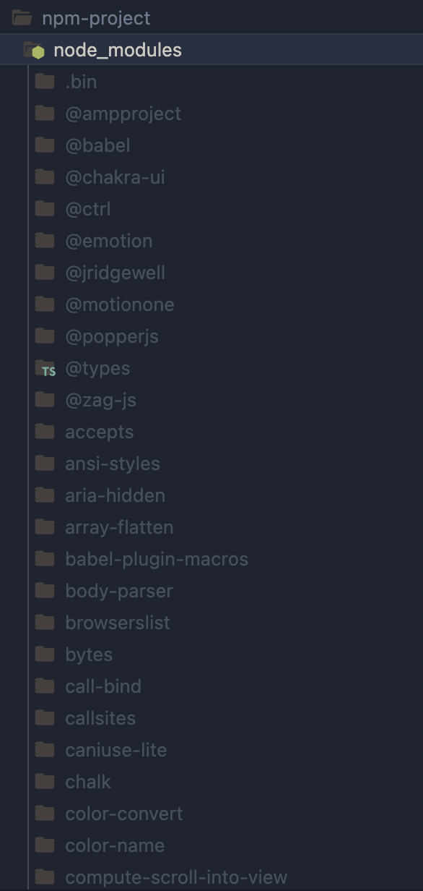
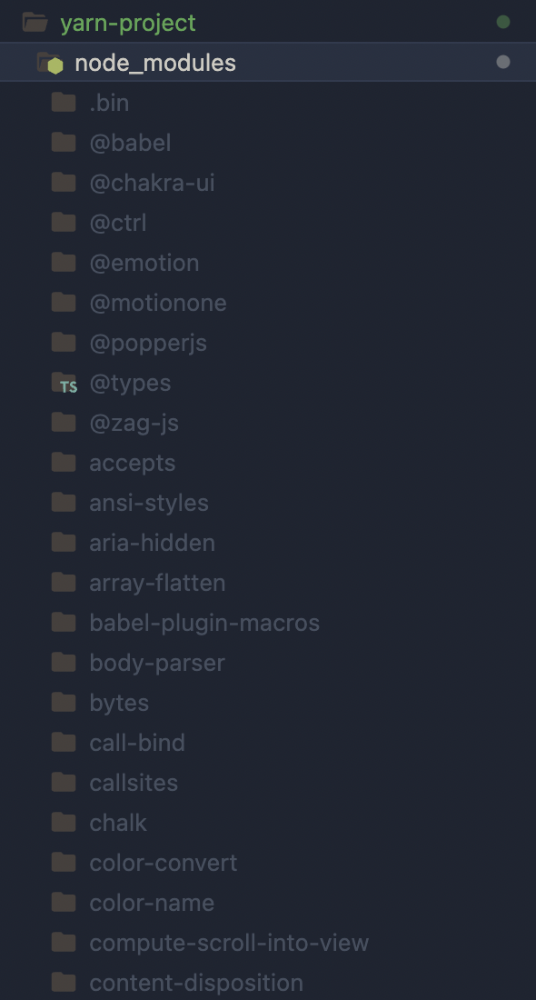
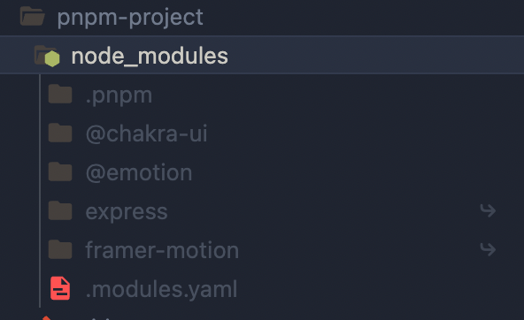

# PNPM POC

The purpose of this repository is to investigate the advantages and disadvantages of using PNPM as a package manager.

## Why use pnpm?

- Saving disk space
- Boosting installation speed
- More security
- Offline mode

You can read more about the motivations to use pnpm here:

- https://pnpm.io/motivation
- https://medium.com/pnpm/why-should-we-use-pnpm-75ca4bfe7d93#:~:text=pnpm%20is%20not%20only%20faster,them%20from%20the%20global%20store.

## How does it work?

One of the main features of PNPM is Creating a non-flat node_modules directory.


When installing dependencies with npm or Yarn Classic, all packages are hoisted to the root of the modules directory. As a result, source code has access to dependencies that are not added as dependencies to the project.

By default, pnpm uses symlinks to add only the direct dependencies of the project into the root of the modules directory.

## Installation

Install pnmpm with npm

```bash
  npm install -g pnpm
```

For more installation instructions you can read the installation guide found at: : https://pnpm.io/es/installation

## Installation times

Time it takes to install Chakra-UI:

- NPM: 5.15s user 2.02s system 31% cpu 22.981 total
- YARN: 5.04s user 3.17s system 22% cpu 37.268 total
- PNPM: 3.97s user 3.10s system 64% cpu 10.896 total

Time it takes to install Express:

- NPM: 0.59s user 0.10s system 34% cpu 2.003 total
- YARN: 1.36s user 0.51s system 33% cpu 5.544 total
- PNPM: 0.74s user 0.19s system 39% cpu 2.370 total

For other comparisons with NPM and YARN see the information found here: https://pnpm.io/feature-comparison

## Differences in node_modules folder structure

NPM node_modules folder:


YARN node_modules folder:


PNPM node_modules folder:


## License

[MIT](https://choosealicense.com/licenses/mit/)
